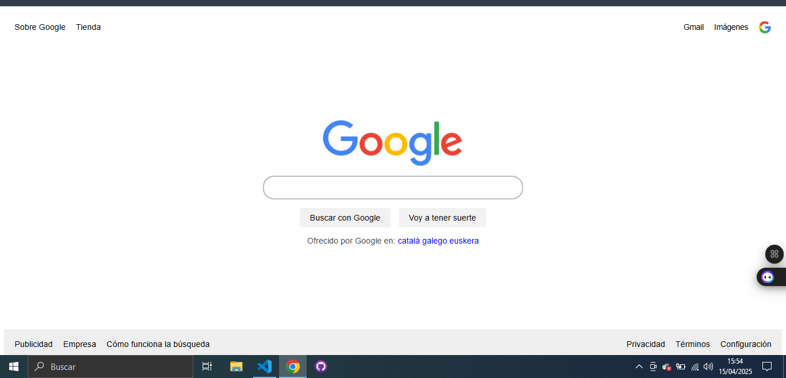

# replica-google
En este repositorio voy a recrear la pagina principal de Google.
He replicado la página inicial de Google como ejercicio de dominio de HTML y CSS en The Odin Project. Además he utilizado Flexbox para conseguir organizar mejor el header y el footer de la web.
Conforme la iba creando he ido asimilando automatizando conceptos básicos a la hora de diseñar con flexbox, también me he ayudado de la IA para utilizar los sombreados y sus transiciones.

Aquí dejo una captura de pantalla del resultado final!:
